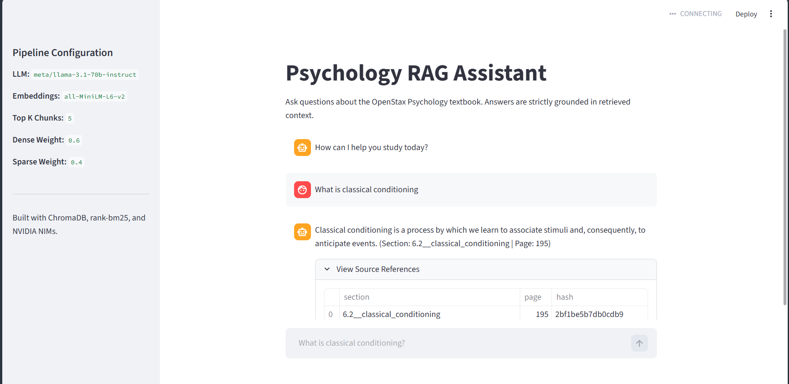
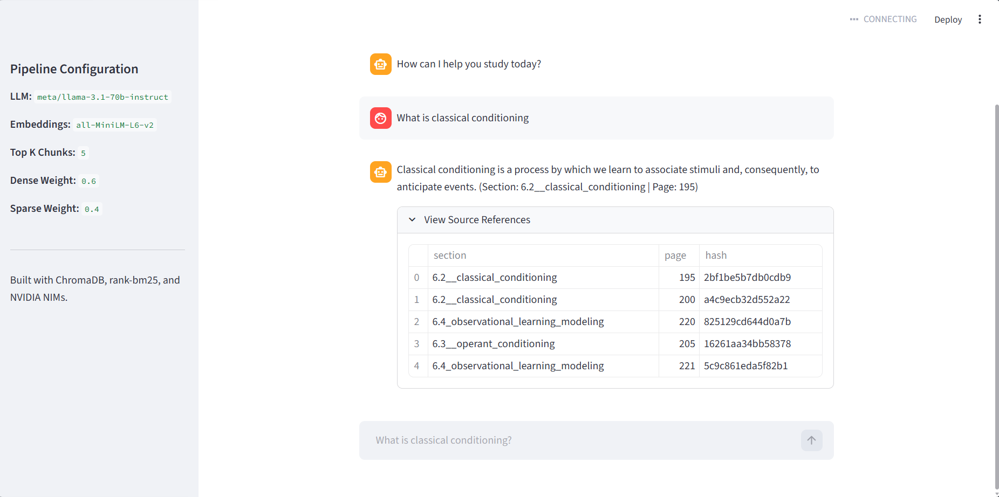

# RAG Assistant for Intelligent Document Question Answering

This project implements a Retrieval-Augmented Generation (RAG) pipeline over the OpenStax Psychology textbook. It is built to ensure zero hallucinations by answering from the retrieved context and providing page, section, and chunk hash citations for every answer.

##  Architecture OVERVIEW

The pipeline is split into three main phases:

### 1. Ingestion Pipeline (`src/ingestion/`)

- **Parsing:** Extracts text from the PDF using `PyMuPDF`.
- **Chunking:** Section-aware chunking preserving section titles and page numbers.
- **Hashing:** Deterministic SHA-256 chunk hashing for stable document IDs.
- **Embedding & Storage:** Generates local vector embeddings using `sentence-transformers` (`all-MiniLM-L6-v2`) and persists them to `ChromaDB`.

### 2. Retrieval Pipeline (`src/retrieval/`)

- **Hybrid Search:** Combines Dense Semantic Search (Cosine distance in ChromaDB) and Sparse Keyword Search (`rank-bm25`).
- **Reranking:** Normalizes and merges scores using configurable weights (`DENSE_WEIGHT = 0.6`, `SPARSE_WEIGHT = 0.4`).
- Returns the Top-K most relevant chunks with full metadata.

### 3. Generation Pipeline (`src/generation/`)

- **Strict Prompting:** Instructs the LLM to only use provided context.
- **NVIDIA NIM Integration:** Calls `meta/llama-3.1-70b-instruct` securely via the NVIDIA API endpoint.
- **Formatting:** Outputs the final answer accompanied by structured references.

---

##  Tech Stack

- **Embeddings:** `sentence-transformers` (`all-MiniLM-L6-v2`)
- **Vector Database:** `ChromaDB` (Persistent SQLite)
- **Sparse Retrieval:** `rank-bm25`
- **LLM Provider:** NVIDIA API (`google-generativeai` and OpenAI direct APIs were strictly avoided as per constraints)
- **Frontend:** `Streamlit`
- **Types & Linting:** Strictly typed with `basedpyright`/`pylance`

---

## 📊 Output Screenshot






## Getting Started

### 1. Setup Environment

Ensure you have Python 3.12+ installed. Create your virtual environment and install dependencies:

```bash
python -m venv myenv
myenv\Scripts\activate
pip install -r requirements.txt
```

_(Note: If `requirements.txt` is missing, you can install the core packages: `sentence-transformers chromadb rank-bm25 google-generativeai python-dotenv openai streamlit pymupdf langchain-text-splitters`)_

### 2. Configure API Keys

Copy the environment template:

```bash
cp .env.example .env
```

Edit `.env` and add your NVIDIA API key:
`NVIDIA_API_KEY=your_key_here`

_(Note: `.env` is safely gitignored so your key won't be pushed to GitHub)._

---

##  Running the Pipeline

###  Option 1: Web UI (Streamlit)

To launch the interactive chat interface:

```bash
streamlit run app.py
```

###  Option 2: CLI (Command Line)

The core architecture is orchestrated through `main.py`.

**Step A: Ingest Data (Only required once)**

```bash
python main.py ingest
```

**Step B: Ask a Question**

```bash
python main.py query "What is classical conditioning?"
```

**Step C: All In One**

```bash
python main.py ingest-and-query "What is classical conditioning?"
```

---

##  Repository Structure

```text
├── .env.example              # Template for secrets
├── .gitignore                # Protects .env, virtual envs, and large db files
├── app.py                    # Streamlit Web Interface
├── main.py                   # Command Line Orchestrator
├── data/
│   ├── raw/                  # Original PDF textbook
│   ├── processed/            # Serialized JSON chunks
│   └── vectorstore/          # Persistent ChromaDB sqlite database
└── src/
    ├── ingestion/            # Parsing, chunking, embeddings, vector_store
    ├── retrieval/            # Query embedder, hybrid search
    ├── generation/           # Prompts, LLM client, Formatter
    └── utils/
        └── config.py         # Global weights, models, paths
```
